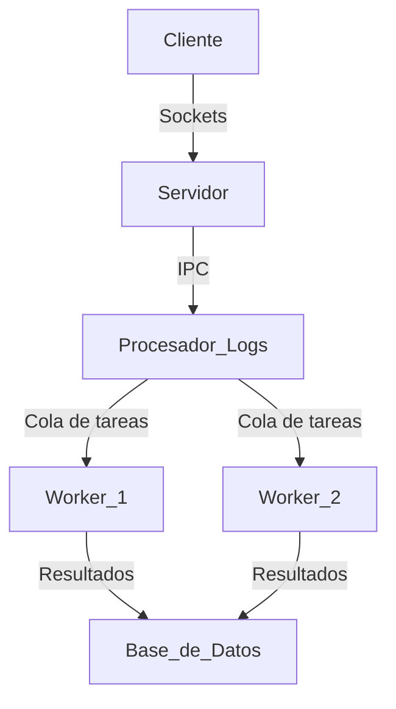

# INFO.md - Sistema de Procesamiento de Logs

## Arquitectura del Sistema

El sistema fue diseñado como una aplicación distribuida para el procesamiento eficiente de archivos de logs, utilizando un modelo cliente-servidor con procesamiento asíncrono y distribuido de tareas. La arquitectura se compone de tres componentes principales:

1. **Cliente**: Aplicación que envía archivos de logs al servidor.
2. **Servidor**: Recibe archivos, los almacena y los envía a la cola de procesamiento.
3. **Workers**: Procesan los archivos de logs realizando análisis, limpieza y generación de informes.

## Arquitectura del Sistema

## Decisiones de Diseño

### Comunicación Cliente-Servidor mediante Sockets y AsyncIO

**Justificación**: Se implementó un protocolo basado en sockets TCP utilizando la biblioteca `asyncio` de Python para permitir:

- **Comunicación bidireccional**: Permite que el cliente reciba retroalimentación inmediata del servidor.
- **Manejo de múltiples conexiones concurrentes**: El servidor puede atender a varios clientes simultáneamente sin bloquear.
- **Transferencia eficiente de archivos**: El enfoque por chunks mejora la gestión de memoria, especialmente para archivos grandes.
- **Operaciones no bloqueantes**: Las operaciones I/O intensivas no bloquean el hilo principal.

AsyncIO fue elegido sobre multithreading tradicional porque:
- Ofrece mejor rendimiento para operaciones I/O-bound como las transferencias de archivos.
- Reduce la sobrecarga de cambio de contexto presente en el modelo de hilos.
- Proporciona un modelo de programación más limpio para operaciones concurrentes.

### Procesamiento Asíncrono con RabbitMQ y Celery

**Justificación**: La implementación de un sistema de colas de tareas usando RabbitMQ como broker y Celery como framework de tareas distribuidas permite:

- **Desacoplamiento**: Separa la recepción de archivos de su procesamiento, evitando cuellos de botella.
- **Escalabilidad horizontal**: Se pueden añadir más workers según la carga de trabajo sin modificar el código.
- **Tolerancia a fallos**: Las tareas pendientes persisten en caso de caída de un worker.
- **Procesamiento asíncrono**: Los clientes no necesitan esperar a que se procese completamente su archivo.
- **Distribución de carga**: Las tareas se distribuyen automáticamente entre los workers disponibles.

### Paralelismo vs. Concurrencia

El sistema implementa una combinación de:

- **Concurrencia** vía AsyncIO en el servidor para manejar conexiones entrantes sin bloquear.
- **Paralelismo** vía `multiprocessing` para el procesamiento intensivo de CPU durante el análisis inicial de logs.
- **Procesamiento distribuido** vía Celery para operaciones complejas de análisis, limpieza y generación de informes.

Esta combinación maximiza la eficiencia del sistema utilizando:
- AsyncIO donde predominan operaciones I/O-bound.
- Multiprocessing donde se necesita paralelismo real y procesamiento CPU-bound.
- Celery donde se beneficia de la distribución de cargas de trabajo y el desacoplamiento.

### Almacenamiento con SQLite

**Justificación**: Se eligió SQLite como sistema de almacenamiento porque:

- Proporciona persistencia de datos sin necesidad de configurar un servidor de base de datos.
- Es suficientemente rápido para la escala esperada del proyecto.
- Ofrece capacidades transaccionales para mantener la integridad de los datos.
- Facilita futuras migraciones a sistemas como PostgreSQL o MySQL si el proyecto escala.

El esquema de base de datos se ha diseñado para:
- Almacenar cada entrada de log de forma estructurada para facilitar el análisis.
- Mantener estadísticas agregadas para acceso rápido a métricas.
- Almacenar resultados de análisis y reportes para consultas posteriores.

## Flujo de Trabajo del Sistema

1. **Recepción de archivos**:
   - El cliente envía un archivo al servidor usando sockets TCP.
   - El servidor recibe el archivo, lo almacena localmente y añade una tarea a la cola.

2. **Procesamiento inicial**:
   - Un proceso separado en el servidor analiza el archivo línea por línea.
   - Utiliza expresiones regulares para extraer información estructurada.
   - Almacena las entradas y estadísticas básicas en la base de datos.

3. **Procesamiento avanzado** (vía Celery):
   - Task 1: Limpieza de datos para eliminar entradas corruptas o irrelevantes.
   - Task 2: Análisis de patrones para identificar tendencias y problemas comunes.
   - Task 3: Generación de informes estadísticos sobre los logs procesados.

## Ventajas de la Arquitectura Implementada

1. **Alta disponibilidad**: El servidor puede seguir aceptando archivos incluso si el procesamiento está congestionado.
2. **Escalabilidad**: Se pueden añadir más workers para aumentar la capacidad de procesamiento.
3. **Flexibilidad**: Fácil adición de nuevas tareas de análisis sin modificar la infraestructura básica.
4. **Resiliencia**: Las tareas persisten en la cola si un worker falla y pueden ser retomadas más tarde.
5. **Eficiencia**: Uso óptimo de recursos mediante concurrencia y paralelismo según la naturaleza de cada operación.

## Consideraciones Futuras

- Migración a una base de datos más robusta como PostgreSQL para manejar volúmenes mayores de datos.
- Implementación de un panel de control web para monitorizar el estado del sistema y visualizar los informes.
- Añadir más tareas de análisis avanzado utilizando técnicas de machine learning para detección de anomalías.
- Implementación de autenticación y autorización para clientes.
- Integración con sistemas de monitorización como Prometheus/Grafana.