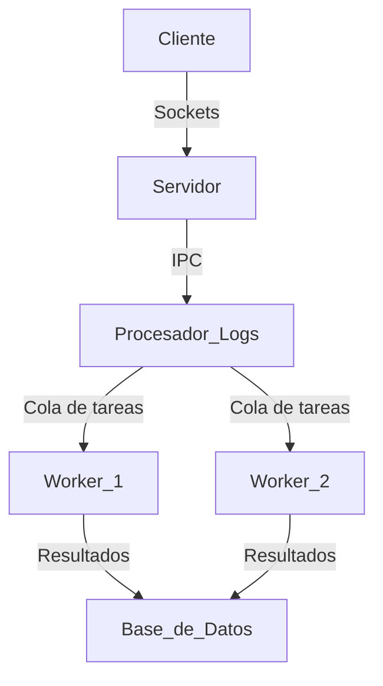

# Proyecto Final Computación 2

## Análisis/Limpieza de datos

### Alumno: Franco Dino Meschini


# Log Analyzer - Proyecto Final

## Descripción del Proyecto
Quiero armar una app cliente-servidor que procese archivos de logs de manera eficiente. El cliente enviará archivos de logs al servidor, donde serán almacenados y procesados. Se usará concurrencia en el servidor para manejar múltiples clientes simultáneamente y paralelismo en el análisis de los logs mediante colas de tareas distribuidas. Las entidades se comunicarán de manera asincrónica usando sockets e IPC, y los resultados del procesamiento se almacenarán en una base de datos.

El sistema realizará una limpieza de datos para eliminar entradas irrelevantes o corruptas y, opcionalmente, ejecutará análisis avanzado sobre los logs, como detección de patrones o generación de reportes estadísticos.

## Arquitectura del Sistema


## Funcionalidades
### Cliente
- Enviar archivos de logs al servidor.
- Soporte para múltiples clientes simultáneos.

### Servidor
- Recibir archivos de logs y almacenarlos.
- Distribuir las tareas de procesamiento a través de IPC.
- Enviar tareas a la cola de procesamiento distribuido.

### Procesador de Logs
- Limpieza de datos: eliminación de entradas irrelevantes o corruptas.
- Extraer información relevante de los logs.
- Clasificar eventos y detectar anomalías.
- Opcionalmente, realizar análisis avanzado de logs.
- Guardar resultados en una base de datos o archivo estructurado.

## Tecnologías Utilizadas
- **Sockets**: Comunicación cliente-servidor.
- **Multiprocesamiento y Hilos**: Manejo de concurrencia.
- **Colas de tareas (Celery)**: Distribución de cargas de trabajo.
- **IPC (Multiprocessing, Pipes, Shared Memory)**: Comunicación entre procesos.
- **Asincronismo (asyncio)**: Manejo eficiente de tareas concurrentes.
- **Base de Datos (SQLite, PostgreSQL, o similar)**: Almacenamiento de resultados.

# Instrucciones de Uso y Despliegue

## Configuración Local

### Requisitos Previos
1. Python 3.7+ instalado
2. RabbitMQ instalado (para Celery)
3. Git (opcional, para clonar el repositorio)

### Pasos para Configuración Local

1. **Instalar dependencias**:
   ```bash
   pip install -r requirements.txt
   ```

2. **Configurar variables de entorno**:
   Crea un archivo `.env` en el directorio raíz con el siguiente contenido:
   ```
   HOST=127.0.0.1
   PORT=8888
   STORAGE_PATH=logs
   DB_PATH=logs.db
   BROKER_URL=pyamqp://guest@localhost//
   ```

3. **Crear directorios necesarios**:
   ```bash
   mkdir -p logs
   ```

4. **Iniciar el servidor**:
   ```bash
   python server.py
   ```

5. **Iniciar los workers de Celery** (en otra terminal):
   ```bash
   celery -A workers worker --loglevel=info
   ```

6. **Enviar archivos de logs usando el cliente**:
   ```bash
   python client.py ruta/al/archivo.log
   ```

